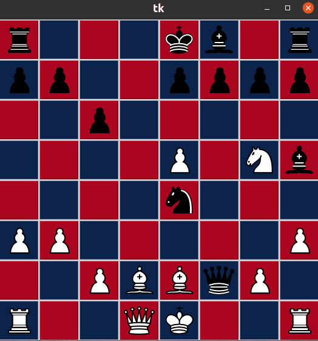

# Summary
This project has two parts: a chess gui made in tkinter, and a chess ai in java. 

I chose not to include *castling* or *en passant* because that would make move calculation more complicated. To accomidate not having *en passant* the pawns cannot move two squares to open. Therefore technically this is a chess variant. 

# Requirements
## Python
Python 3 with tkinter, numpy
## Java
You must have a jre *and* jdk installed. You can install a [jre here](https://www.oracle.com/java/technologies/javase-jre8-downloads.html) , and a [jdk here ](https://www.oracle.com/java/technologies/javase/javase-jdk8-downloads.html)

# How to use

## Human vs AI
Run Board.py. The gui will appear with the standard layout. 

To move a piece, click on it. The possible squares you can move that piece to will be highlighted yellow. Click on one of the highlighted squares to complete the move. 

Note you cannot choose illegal moves that would put you into check. 

Finally, when you lose, which you will, you wil be notified by the board changing from ASU colors to U of A colors. 

# Code structure
...

# Testing
...